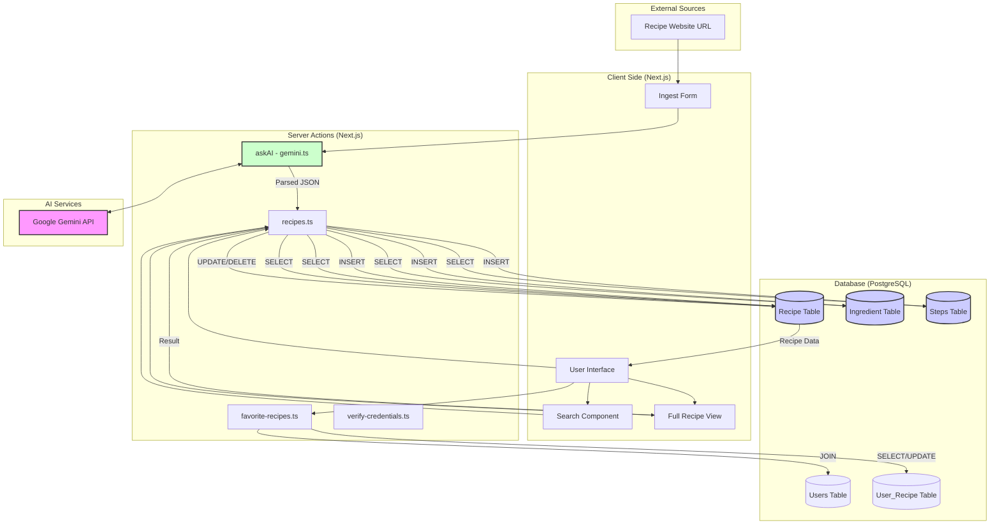

# Data Flow Diagram

This diagram visualizes how data flows through the **Smart Recipes** application, from recipe ingestion to user interaction and retrieval.

## Data Flow Descriptions

### 1. Recipe Ingestion
- **Input**: The user provides a URL of a recipe website.
- **Processing**: The `askAI` action sends a prompt to **Google Gemini** to extract recipe details (ingredients, steps, metadata) into a structured JSON format.
- **Storage**: The `insertRecipe` action uses a transaction to save the data into the `recipe`, `ingredient`, and `steps` tables.

### 2. Recipe Retrieval
- **Listing**: The home page calls `getRecentRecipes` and `getFavoriteRecipes` to display cards.
- **Searching**: The `searchRecipes` action performs a case-insensitive `ILIKE` query on the `recipe` table.
- **Full View**: `getFullRecipeById` retrieves all related data (ingredients, steps) and checks if the recipe is favorited by the current user.

### 3. User Interactions
- **Favoriting**: `toggleFavoriteRecipe` adds or removes a record in the `user_recipe` join table.
- **Editing**: Users can modify recipe details, which triggers updates to the main table and replaces ingredients/steps.
